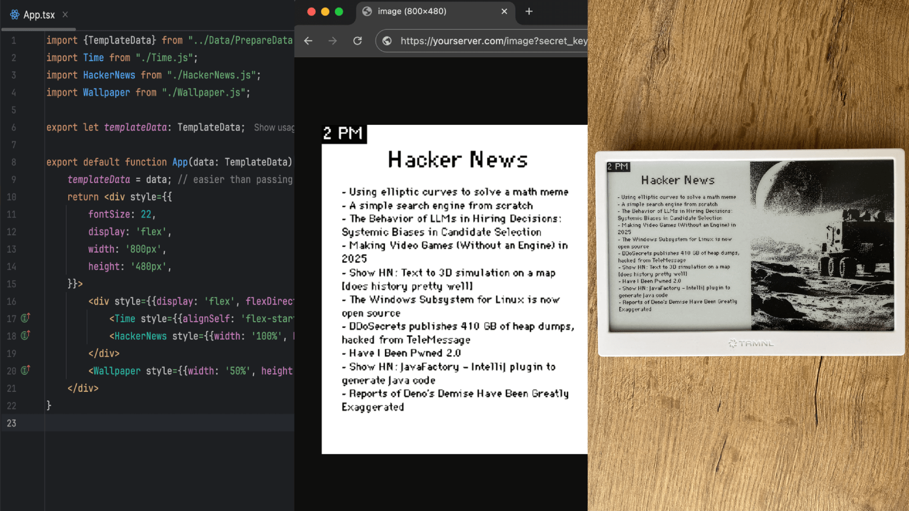
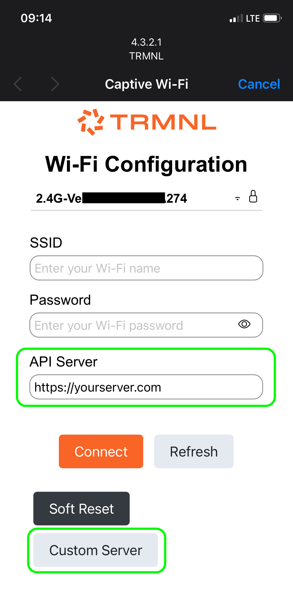

# Image server for TRMNL built with Node.js, JSX and HTML
You can create TRMNL screen just like website: collect data with JavaScript and design layout with JSX(React) or HTML with Liquid templates.

This repository generates an image that you can use via [Redirect](https://help.usetrmnl.com/en/articles/11035846-redirect-plugin)
or [Alias](https://help.usetrmnl.com/en/articles/10701448-alias-plugin) plugins, or run it as
own [BYOS](#bring-your-own-server-byos).

Goal: simple and easy to customize starter for people who are already familiar with the JavaScript ecosystem.



## Features
- Creating screens with JSX or HTML (Liquid)
- Design Framework from TRMNL
- Generating screen (image) with preview
- JSON Data API
- BYOS (auto-provisioning, screens, device logs)
- Migrating any Plugin (they are in Liquid) 
- Playlists (set of screens)
- Proxying screens (plugins) from Core
- Docker
- no database required (everything in ENV and Config)
- no dashboard

## Quick Start

1. Press button `Use this template` on Github, or clone this repository
2. Copy .env.local to .env.example and change values to yours
3. Run `npm run watch` for local preview

Or run via Docker:

```shell
docker build -t trmnl . && docker run --env-file .env.local -p 3000:3000 trmnl
```

After run, you can change files in `src/Template` and `src/Data` to something that you want to display.

Later, to display screen on device you would need to [deploy](#your-server), provide [endpoints](#endpoints-for-plugins)
in plugin settings, or setup your device to [BYOS](#bring-your-own-server-byos).

--------

## Technologies used:

- [Headless Chrome](https://www.npmjs.com/package/puppeteer) for rendering HTML or JSX to image
- [Liquid](https://shopify.github.io/liquid/) for HTML templating (same used by usetrmnl.com)
- [React](https://react.dev/reference/react-dom/server/renderToString) if you want to use JSX components
- [Express.js](https://expressjs.com) as API server
- [TSX](https://tsx.is) for supporting JSX/TSX files

## Endpoints for plugins

**Image** https://yourserver.com/image?secret_key=... <br>
↑ can be used for preview and [Alias](https://help.usetrmnl.com/en/articles/10701448-alias-plugin) plugin

**JSON** https://yourserver.com/plugin/redirect?secret_key=... <br>
↑ can be used for [Redirect](https://help.usetrmnl.com/en/articles/11035846-redirect-plugin) plugin

## Liquid templates
For putting variables into HTML we use  Liquid templating library (same as TRMNL).<br>
Its a great option for moving custom plugins from usetrmnl.com to your own server.<br>
Liquid files are in `src/Template` directory with `.liquid` extension. Most of their contents is regular HTML.
See example [here](../src/Template/HackerNews.liquid)

## JSX components

- You can use regular JSX components (similar to React), but without hooks, as screen is rendering only once.<br>
- Starting point is [App.tsx](../src/Template/JSX/App.tsx) <br>
- It's easier to collect all variables and data [in one place](../src/Data/PrepareData.ts), before components. But you
  can change to any structure that you prefer.
- You can include local images by using [LocalImage](../src/Template/JSX/LocalImage.tsx) component or specify public url
  to somewhere.

## Design Framework
You have full support of JavaScript and CSS, so you can use [Framework](https://usetrmnl.com/framework) by TRMNL:
```html
<html>
<head>
    <link rel="stylesheet" href="https://usetrmnl.com/css/latest/plugins.css">
    <script src="https://usetrmnl.com/js/latest/plugins.js"></script>
</head>
<body class="environment trmnl">
<div class="screen">
    <div class="view view--full">
        <div class="layout">
            <div class="columns">
                <div class="column">
                    ...
                </div>
            </div>
        </div>
    </div>
</div>
```
See example in [HackerNews.liquid](../src/Template/HackerNews.liquid)

## Your Server

To run your TRMNL server you need any form of server (VM, droplet, pod, instance) somewhere, for example AWS, Google
Cloud, Digital Ocean.

- it can be run via [Dockerfile](../Dockerfile) or command `npm run start`
- Better to pass ENV parameters from secure storage that your cloud provider has

## Bring your own server (BYOS)

You can skip using plugins and connect your device to your server directly by
using [BYOS](https://docs.usetrmnl.com/go/diy/byos) mode. After changing configuration to BYOS your device will stop
doing API requests to [usetrmnl.com](https://usetrmnl.com) servers. You can even close it in private network for data
security.

This repo implements basic BYOS server for one device.<br>

You can enable it with those steps:

1. Set `BYOS_ENABLED = true` in [Config](../src/Config.ts)
2. Put your device's MAC value to ENV key BYOS_DEVICE_MAC (it can be via .env.local). If you don't know it - you can do
   this step later.
3. Generate or use usetrmnl.com access token in ENV key BYOS_DEVICE_ACCESS_TOKEN
4. Hold round button on your device for more than 5 seconds - you should see connection instructions on screen.
5. Connect your phone to wifi called `TRMNL`
6. On setup choose `Custom server` (see screenshot below) and provide address of your server. In case of local computer
   in same WiFi network it would be something like http://192.168.0.26:3000



Troubleshooting:

- To find out MAC address for step 1 you can check logs of server: it will be attempts to connect
- If you see error `wrong access-token value from device` - you may need to click button `Soft reset` on device setup
  stage

## BYOS Proxy

You can use both own server with own screen and some plugins from usetrmnl.com (aka core) by using Proxy mode. In this
mode you will see your screen, one of screens from core after, and etc, one by one.

You can enable it with those steps:

1. Set `BYOS_PROXY = true` in [Config](../src/Config.ts)
2. Repeat setup process for `BYOS` with doing `soft reset`
3. Check `access-token` received from usetrmnl.com and change ENV key BYOS_DEVICE_ACCESS_TOKEN to it

---
Goal of this repo: simple and easy to customize.
